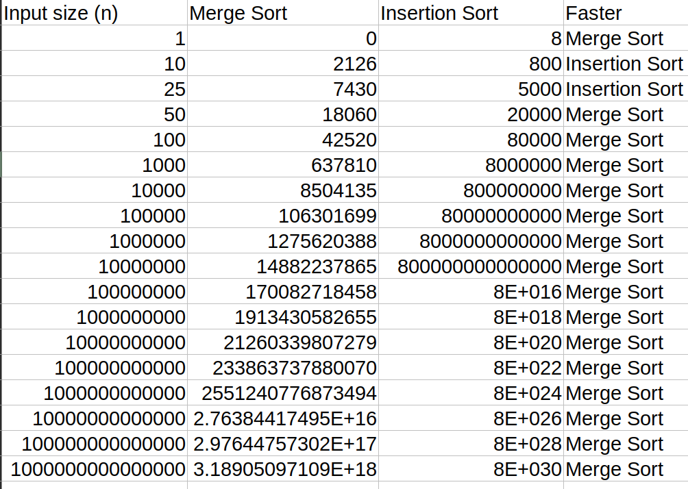
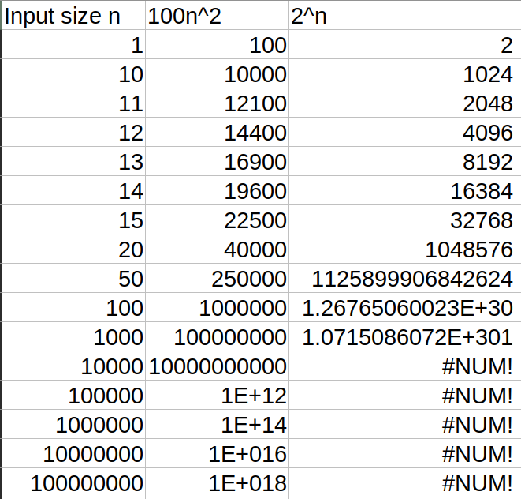

# Chapter 1 - Exercises 1.2

1.2-1 Example of an application that requires algorithmic content at the application level:

1) **Embedded Software - Supervisor (computer)**

* Nowadays, safety-critical embedded systems that run real-time applications, such as the flight
controller on a rocket ship uses a supervisor to monitor the main controller. The main task of
the system supervisor (just another computer) is to make sure that the main controller is working
properly. The supervisor heavily rely on algorithms to function properly, some examples would be:

* Scheduling algorithms to make sure that the supervisor software is executed in time and correctly

* Online algorithms to analyze the data coming from the main controller being supervised.

2) **Uber**

* This mobile application heavily relys on algorithms in order to calculate the shortest-path
distance to travel when a new trip is ordered in order to maximize the time and costs.

1.2-2 Suppose that for inputs of size n on a particular computer, insertion sort runs in
8 n2 steps and merge sort runs in `64 n lg n` steps.

For which values of n does insertion sort beat merge sort?

Insertion sort is faster than merge sort when the input size (n) is smaller than
25, after that the benefits of using merge sort over insertion sort are pretty
obviou as seen on this image:

1.2-3 What is the smallest value of n such that an algorithm whose running time is
100 n2 runs faster than an algorithm whose running time is 2n
on the same machine?

15

